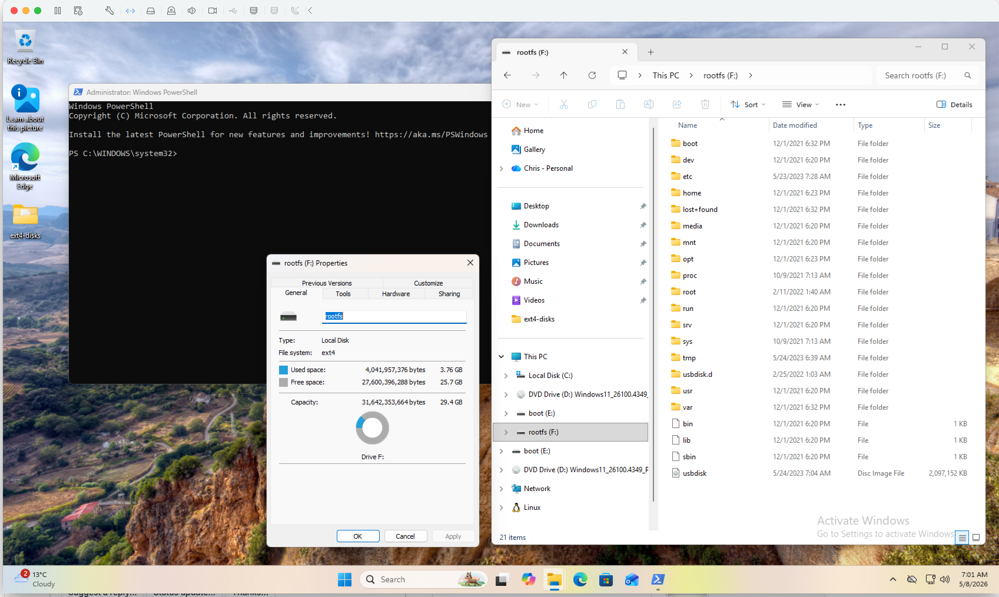

# ext4-win-driver

## Overview

This project provides Windows-first userspace tooling for ext4 volumes, built on the `fs-ext4` Rust library.



*A Raspberry Pi root-filesystem SD card plugged into a Windows 11 ARM64
host, auto-mounted on `F:` by the `ExtFsWatcher` service and browsable in
Explorer the moment it appeared.*

Scope:

1. **Auto-mount service** -- plug an ext4 SD card or USB stick into Windows
   and the `ExtFsWatcher` service mounts it on a free drive letter in the
   active console session. Detach and it unmounts cleanly.
2. **Right-click verb** -- "Mount as ext4" on `.img` files in Explorer for
   offline disk images.
3. **CLI browser** -- open an ext4 image or raw device; list/stat/read
   files without mounting. Cross-platform (macOS/Linux work too -- handy
   for testing).
4. **Setup.exe** -- bundles WinFsp via a Burn bootstrapper, so end users
   only run one installer.

The `fs-ext4` library lives at [`vendor/rust-fs-ext4/`](./vendor/rust-fs-ext4)
(git submodule from [christhomas/rust-fs-ext4](https://github.com/christhomas/rust-fs-ext4))
and is path-depended; this crate is the distribution unit.

## Status

Shipped in [v0.1.0](https://github.com/antimatter-studios/ext4-win-driver/releases/tag/v0.1.0):

- [x] CLI: `info`, `ls`, `stat`, `cat`, `tree`, `parts`, `audit`
- [x] MBR/GPT partition parsing (5 unit tests)
- [x] `--part N` mounts a partition slice via the C ABI's callback mount
- [x] Win32 raw-device support (`\\.\X:`, `\\.\PhysicalDriveN`,
      `\\?\STORAGE#Disk#...`) with sector-aligned reads for 4Kn /
      advanced-format drives
- [x] **WinFsp read-only mount** -- verified on Windows 11 ARM64 with
      both VHD smoke tests and a real Raspberry Pi SD card
- [x] **WinFsp read-write mount** (`--rw`) -- create/write/truncate/
      rename/unlink/rmdir/mkdir/utimens wired through the C ABI. v1
      caveat: `write` round-trips the whole file (the underlying ABI is
      a "save-as" replace), so large-file workloads are slow until a
      positional `pwrite` lands in `fs-ext4`.
- [x] **`ExtFsWatcher` SCM service** -- subscribes to disk-class
      arrivals (`GUID_DEVINTERFACE_DISK`), walks the partition table
      directly, probes each partition for the ext4 superblock magic,
      and asks WinFsp.Launcher to spawn a per-partition mount in the
      active console session
- [x] **Right-click .img -> Mount as ext4** verb registered under
      `HKCR\SystemFileAssociations\.img`
- [x] **MSI + Burn bundle** that auto-installs WinFsp if missing
      (chained via the official WinFsp redistributable MSI)

Not yet shipped:

- [ ] x64 Setup.exe (arm64 only in v0.1.0; same code, just hasn't been
      cross-built yet)
- [ ] winget submission
- [ ] Code-signing certificate

## Install (end users)

Download `ext4-win-driver-<ver>-arm64-Setup.exe` from
[Releases](https://github.com/antimatter-studios/ext4-win-driver/releases),
run it, accept the GPL-3 prompt. The installer:

- chains the WinFsp MSI if WinFsp isn't already installed,
- drops `ext4.exe` and `Mount-Ext4.ps1` into `C:\Program Files\ext4-win-driver\`,
- registers `ExtFsWatcher` as an automatic Windows service and starts it,
- registers the `ext4-mount` service-class with WinFsp.Launcher,
- registers the "Mount as ext4" right-click verb on `.img` files.

`Setup.exe /quiet` works for unattended installs. SCCM/Intune deploys
should push the bare MSI separately, after pushing WinFsp.

## Usage

Plug in an ext4 SD card or USB stick: nothing else needed. The service
picks it up, finds the ext4 partition(s), and mounts each on a free drive
letter (E: upward).

CLI (works on any host):

```
ext4 info   <image>                        # volume label, sizes, features
ext4 ls     <image> [path]                 # directory listing
ext4 stat   <image> <path>
ext4 cat    <image> <path>
ext4 tree   <image>
ext4 parts  <image>                        # MBR/GPT partition table
ext4 audit  <image>                        # link-count + dirent integrity scan
ext4 ls     <whole-disk.img> --part 1 /    # browse partition 1
```

Manual WinFsp mount (Windows + `mount` feature):

```
ext4 mount <image> --drive X:                       # read-write (default)
ext4 mount <image> --drive X: --ro                  # read-only
ext4 mount <whole-disk.img> --drive X: --part 1     # mount partition 1
```

Then browse `X:` in Explorer, or `Get-ChildItem X:\`, etc. Ctrl-C to unmount.

### Toggling read-only / read-write

The default for every mount path is **read-write**. Pass `--ro` per-mount,
or use one of the system-wide knobs below:

- **Auto-mount service.** The WinFsp.Launcher CommandLine for the
  `ext4-mount` service-class lives at
  `HKLM\SOFTWARE\WOW6432Node\WinFsp\Services\ext4-mount\CommandLine`
  (32-bit registry view). Default: `mount %2 --drive %1 --part %3`.
  Append ` --ro` there to force every auto-mount read-only.
- **Right-click verb.** The shortcut runs
  [`Mount-Ext4.ps1`](./installer/Mount-Ext4.ps1) which takes a
  `-ReadOnly` switch. Edit
  `HKCR\SystemFileAssociations\.img\shell\MountAsExt4\command` to add
  `-ReadOnly` to the script invocation if you want the verb itself to
  default to RO.
- **Per-mount via PowerShell.** Run `Mount-Ext4.ps1 -ImagePath disk.img
  -ReadOnly` for one-off RO mounts.

The legacy `--rw` flag is still accepted (silently) so existing scripts
and `harness.toml` configs that pre-date the flip don't break.

Watch mode (foreground variant of the service, useful for dev / debugging):

```
ext4 watch                                  # foreground; logs each arrival
```

## Build

CLI only (any platform):

```
cargo build --release
```

WinFsp mount + auto-mount service (Windows only):

```
cargo build --release --features mount,service
```

The release profile statically links the C runtime via
[`.cargo/config.toml`](./.cargo/config.toml) so the binary has no
`libunwind.dll` import -- required for the SCM session-0 launch path
where the LocalSystem PATH doesn't reach the LLVM-MinGW runtime dir.
`panic = "abort"` is set in `Cargo.toml` for the same release profile.

### WinFsp build prerequisites

- **WinFsp 2.1+** installed on the build/run machine
  ([winfsp.dev](https://winfsp.dev/) -> MSI, or `winget install WinFsp.WinFsp`).
- A forked
  [winfsp-rs](https://github.com/antimatter-studios/winfsp-rs) is a
  git submodule at [`vendor/winfsp-rs/`](./vendor/winfsp-rs) on the
  `gnullvm-support` branch (path-depended; the upstream PR is pending).
  The fork also requires:
  - `LLVM` for `libclang.dll` (`winget install LLVM.LLVM`)
  - LLVM-MinGW (`winget install MartinStorsjo.LLVM-MinGW.UCRT`)
- `LIBCLANG_PATH=C:\Program Files\LLVM\bin` so bindgen can find `libclang.dll`.

### Building the installer

After `cargo build --release --features mount,service` finishes:

```powershell
installer\build.ps1 -ExePath target\release\ext4.exe -Arch arm64
```

Produces `dist\ext4-win-driver-<ver>-arm64.msi` and
`dist\ext4-win-driver-<ver>-arm64-Setup.exe`. The script PE-sniffs
`-ExePath` to catch arch mismatches before WiX does. See
[`installer/README.md`](./installer/README.md) for the longer walkthrough
(WiX 7 install, WinFsp redist pin, etc).

## Testing

Scenarios live in [`test-matrix.json`](./test-matrix.json) and the per-project
adapter config in [`harness.toml`](./harness.toml). Both are consumed by the
shared [`fs-test-harness`](https://github.com/antimatter-studios/fs-test-harness),
vendored as a git submodule at [`vendor/fs-test-harness/`](./vendor/fs-test-harness).

After cloning, initialise the submodules:

```sh
git submodule update --init --recursive
```

One-time VM setup, on the Mac:

```sh
bash vendor/fs-test-harness/scripts/setup-local.sh        # writes .test-env
```

Run a scenario end-to-end (Mac -> SSH -> Windows VM -> diag pull):

```sh
bash vendor/fs-test-harness/scripts/test-windows-matrix.sh basic-ro-list
```

Diagnostics land under `test-diagnostics/run-<UTC>/`. See the harness's
[`docs/triage-protocol.md`](./vendor/fs-test-harness/docs/triage-protocol.md)
for how to read a failure, and
[`docs/multi-agent-protocol.md`](./vendor/fs-test-harness/docs/multi-agent-protocol.md)
for running multiple agents against the same matrix.

To update a vendored submodule when its upstream releases:

```sh
git submodule update --remote --merge vendor/fs-test-harness
git add vendor/fs-test-harness && git commit -m "chore: bump fs-test-harness submodule"
```

## License

GPL-3.0 -- inherited from the WinFsp Rust bindings. The CLI alone (without
the `mount` feature) doesn't link winfsp and could be relicensed if split
out, but the single-license declaration keeps the distribution unit simple.
